# DeveloperDo

DeveloperDo is an Android app created to help dev-teams in managing their project. 

## APK file
APK file is not available on Google Play Store. To install it you need to manually download [APK file](https://firebasestorage.googleapis.com/v0/b/developerdo-dcf39.appspot.com/o/apk%2Fdeveloper-do.apk?alt=media&token=53e8186c-08e2-4019-bb93-5313efc9e94a).

## Steps to compile
1. Install Nativescript-vue as instructed by official docs.
2. Copy project's repository using: ```git clone https://github.com/DeveloperDo/DeveloperDo.```
3. Go to project's folder using: ```cd DeveloperDo```
4. Install dependencies by using ```npm install``` or ```yarn install```
5. Start project by running ```tns run android```

## App specification

### Log in
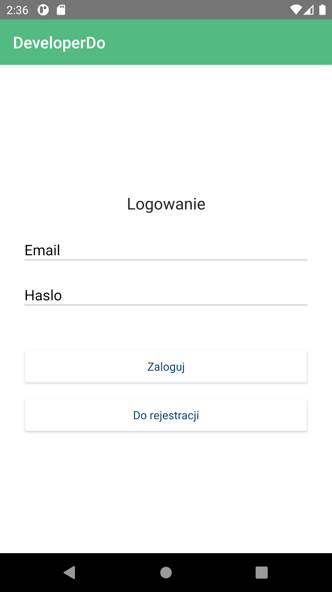

### Register
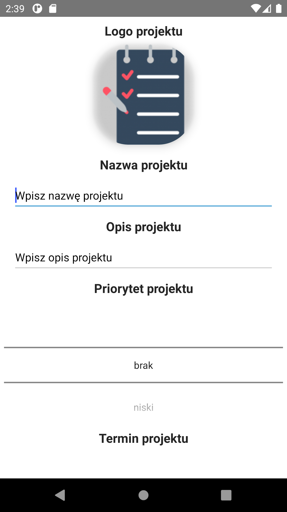

### Create project
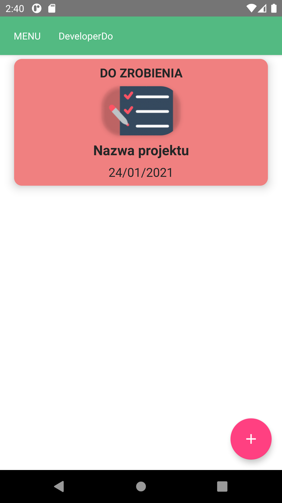

### Projects list
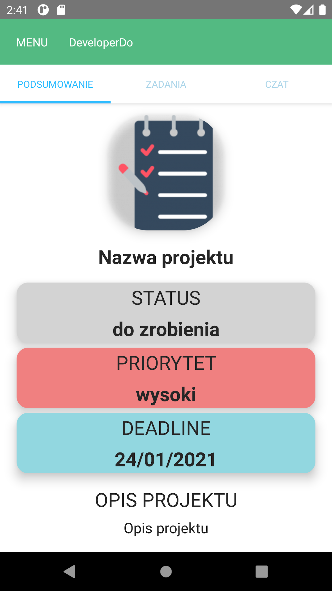

### Project main page
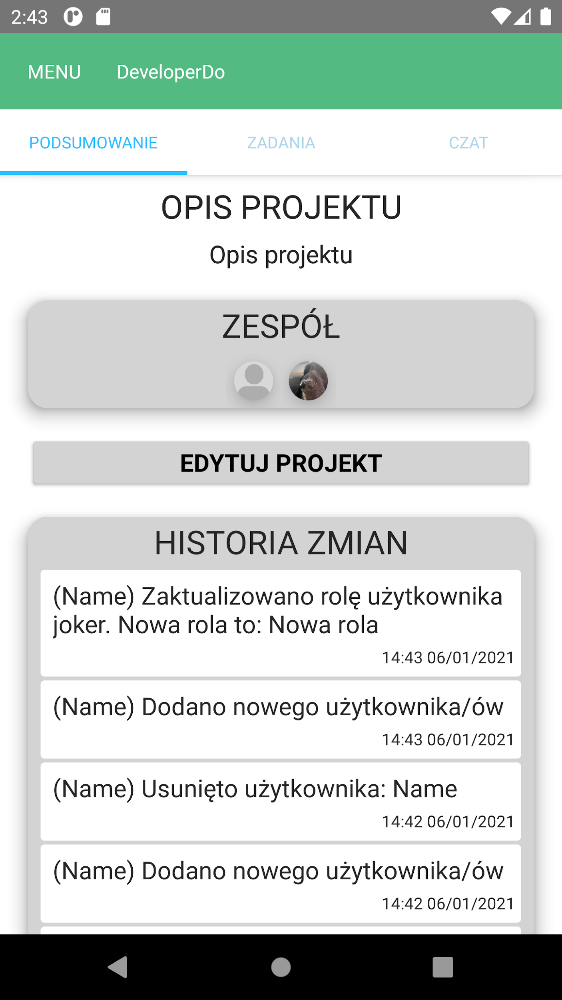

### Add team-member
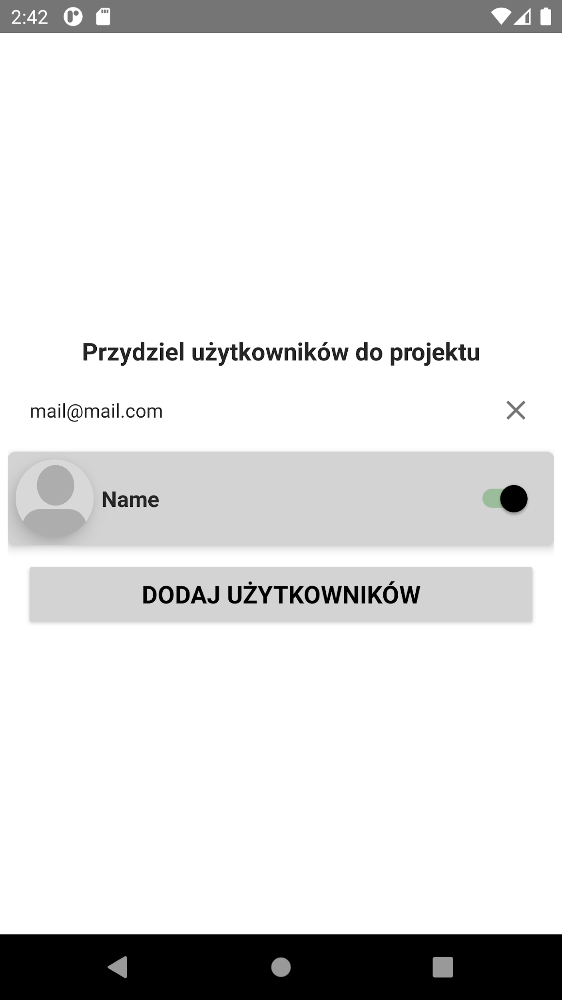

### Team member list
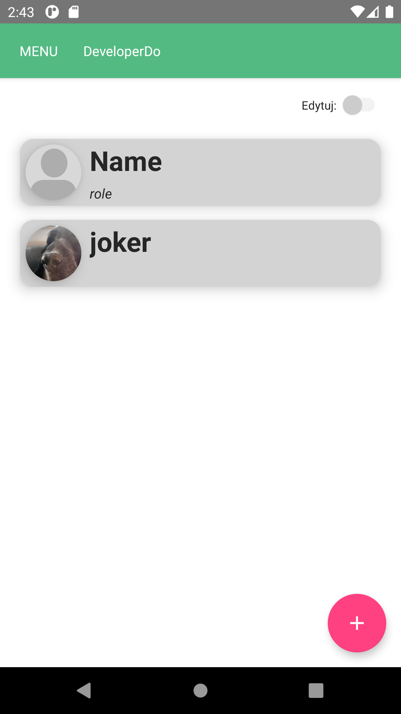

### Assigning roles
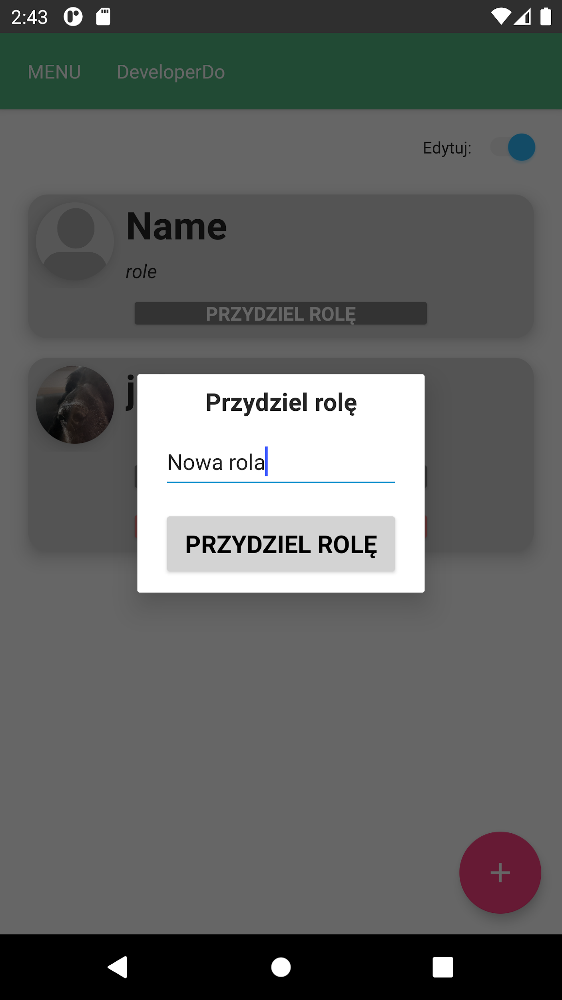

### To-Do list
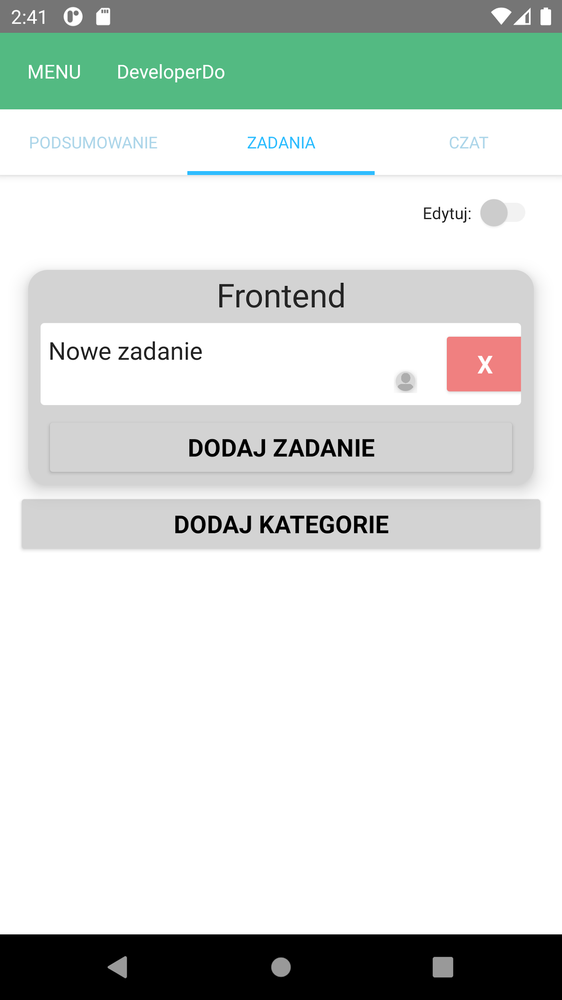

### Adding To-Do
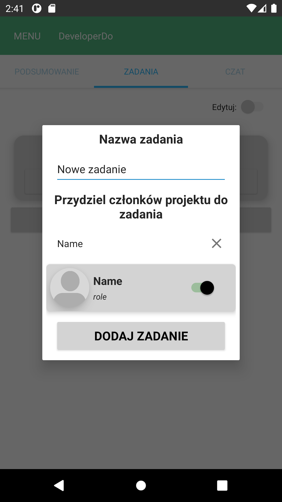

### Text chat
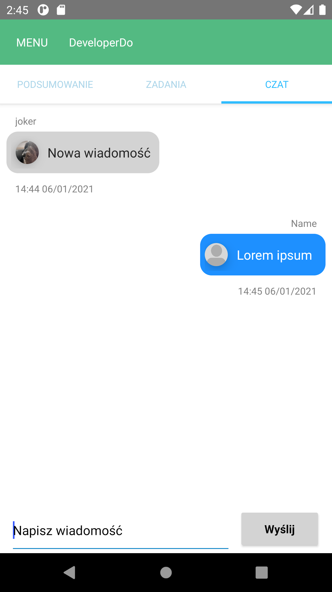

### Sidenav
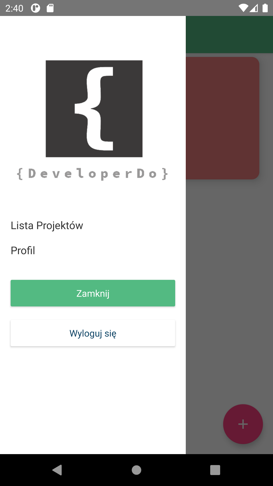

### Profile view
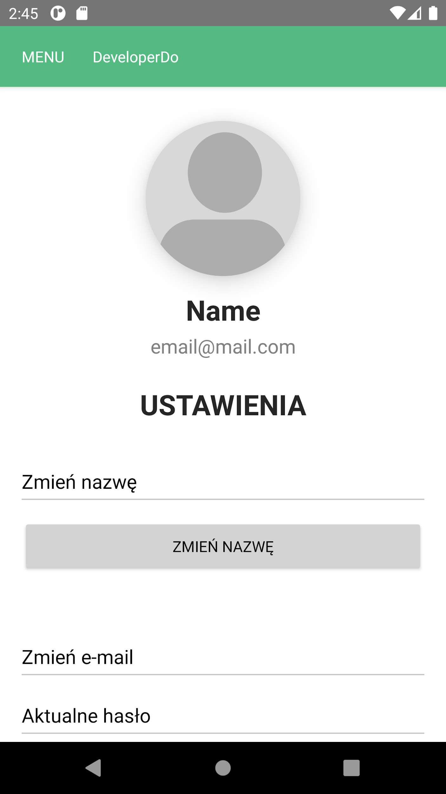
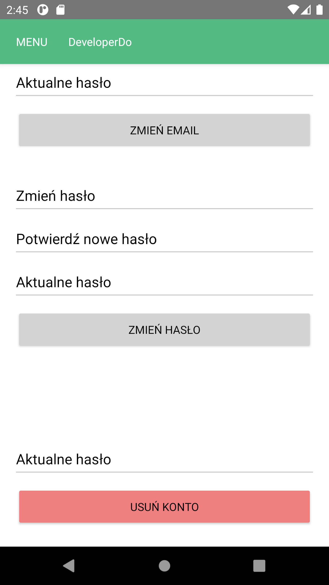

